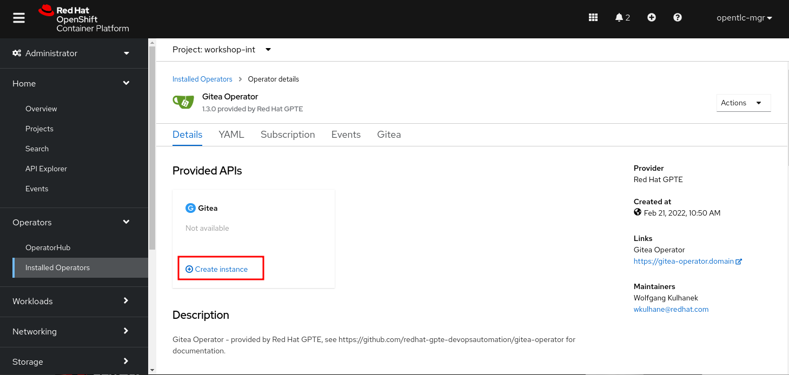
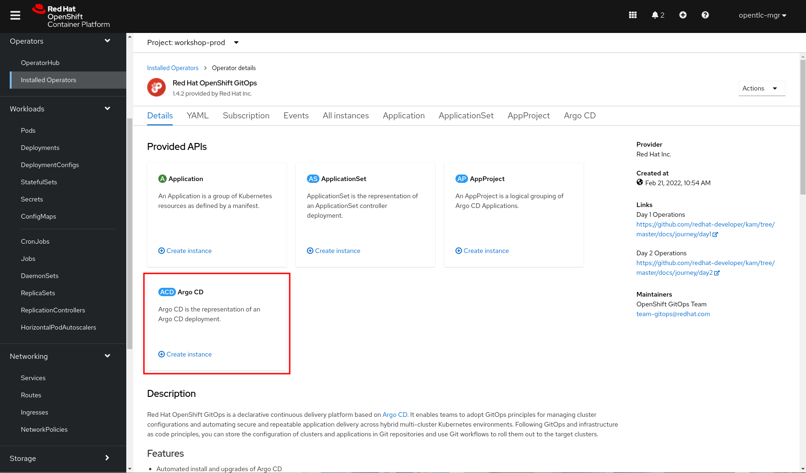
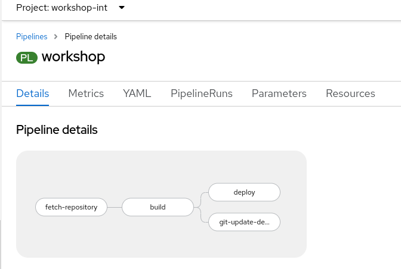

# Workshop OpenShift Pipelines & GitOps 

Prerequisites:

- OC Cli installed
- Git installed
- Editor like vscode
- Internet access

## Login to the WebConsole from OpenShift

OpenShift Webconsole:
comming soon

Login to the OpenShift Webconsole with your User: userx and Password: openshift

## Create new project

Create a new OpenShift project called git-USERX

Go to Installed Operators > Gitea Operator and click on the Create Instance tile in the git-USERX project



On the Create Gitea page switch to the YAML view and add the following spec values :

>  ```yaml
>  spec:
>    ...
>    giteaAdminUser: gitea
>    giteaAdminPassword: "gitea"
>    giteaAdminEmail: gitea@viada.de
>  ```


Click Create

**Notice:** Please be patient for about 2 minutes until gitea is online.


After creation has finished:
- Access the route URL (you’ll find it e.g. in Networking > Routes > repository > Location)
- This will take you to the Gitea web UI
- Sign-In to Gitea with user gitea and password gitea
- Clone the example repo:
  - Click the + dropdown on upper right corner and choose New Migration
  - As type choose Git
  - URL:  https://github.com/mcpdev80/quarkus-build-options.git
  - Click Migrate Repository
  

## Create App Deployment and Build Pipeline
After installing the Operator create a new deployment of your game-changing application:
- Create a new OpenShift project workshop-int-userX
  - Home > Projects right upper corner click on "Create Project"
- Switch to the OpenShift Developer Console
  - On the left side menu click on Administrator ther is a pulldown menu and click on Developer
- Click the +Add menu entry to the left and choose Import from Git
  - As Git Repo URL enter the clone URL for the quarkus-build-options repo in your your Gitea instance (There might be a warning about the repo url that you can ignore)
  - Click Show advanced Git options and for Git reference enter master
  - As Import Strategy select Builder Image
  - As Builder Image select Java and openjdk-11-el7 / Red Hat OpenJDK 11 (RHEL 7)
  - As Application Name enter workshop-app
  - As Name enter workshop
  - Check Add pipeline
  - Click create
  
In the main menu left, click on Pipelines and observe how the Tekton Pipeline is created and run.

## Install OpenShift GitOps

- Create an OpenShift Project workshop-prod-userx
- In the project workshop-prod-userx click on Installed Operators and then Red Hat OpenShift GitOps.
- On the ArgoCD “tile” click on Create instance to create an ArgoCD instance in the workshop-prod-userx project.



- Keep the settings as they are and click Create

## Prepare the GitOps Config Repository

- In Gitea create a New Migration and clone the Config GitOps Repo which will be the repository that contains our GitOps infrastructure components and state
- The URL is  https://github.com/mcpdev80/openshift-gitops-getting-started.git
- Click on create

Please change the namespaces in the Repo to your user (user1 to userx). Those can be changed in the files:
app/deployment.yaml (2x)
and app/imagestream.yaml (1x)

Have quick look at the structure of this project :
- app - contains yamls for the deployment, service and route resources needed by our application. These will be applied to the cluster. There is also a kustomization.yaml defining that kustomize layers will be applied to all yamls
- environments/dev - contains the kustomization.yaml which will be modified by our builds with new Image versions. ArgoCD will pick up these changes and trigger new deployments.

## Setup GitOps Project

Let’s setup the project that tells ArgoCD to watch our config repo and updated resources in the workshop-prod project accordingly.

- Give namespace workshop-prod-userx permissions to pull images from workshop-int-userx
  - On the top right click on your username and then Copy login command to copy your login token
  - On you local machine open a terminal log in with the oc command you copied
  - Please change the userx to your user
  
>  ```bash
>  oc policy add-role-to-user \
>    system:image-puller system:serviceaccount:workshop-prod-userx:default \
>    --namespace=workshop-int-userx
>  ```

- Find the local ArgoCD URL by going to Networking > Routes in namespace workshop-prod-user1
- Open the ArgoCD website ignoring the certificate warning
- Don’t login with OpenShift but with username and password
- User is admin and password will be in Secret argocd-cluster

ArgoCD works with the concept of Apps. We will create an App and point it to the Config Git Repo. ArgoCD will look for k8s yaml files in the repo and path and deploy them to the defined namespace. Additionally ArgoCD will also react to changes to the repo and reflect these to the namespace. You can also enable self-healing to prevent configuration drift. If you want find out more about OpenShift GitOps have look [here](https://docs.openshift.com/container-platform/4.10/cicd/gitops/understanding-openshift-gitops.html).

- Create App
  - Click (+ NEW APP)
  - Application Name: **workshop**
  - Project: **default**
  - SYNC POLICY: **Automatic**
  - Repository URL: Copy the URL of your config repo from Gitea/openshift-gitops-getting-started
  - Path: **environments/dev**
  - Cluster URL: https://kubernetes.default.svc
  - Namespace: **workshop-prod-user1**
  - Click Create
  - Click on Sync and then Synchronize to manually trigger the first sync
  - Click on the workshop to show the deployment graph

Watch the resources (Deployment, Service, Route) get rolled out to the namespace workshop-prod-userx. 
**Notice** at the moment the deployment isn`t working!!!
**Notice** we have also scaled our app to 2 pods in the prod stage as we want some HA.
Our complete prod stage is now configured and controlled though GitOps. But how do we tell ArgoCD that there is a new version of our app to deploy? Well, we will add a step to our build pipeline updating the config repo.
As we do not want to modify our original repo file we will use a tool called  [Kustomize](https://kustomize.io/) that can add incremental change layers to YAML files. Since ArgoCD permanently watches this repo it will pick up these Kustomize changes.

## Add Kustomize and Git Push Tekton Task
Let’s add a new custom Tekton task that can update the Image tag via Kustomize after the build and then push the change to out git config repo.
- In the namespace workshop-int-userx switch to the Administrator Perspective and go to Pipelines > Tasks > Create Task
- Enter the yaml from the following path and click on Create:
https://raw.githubusercontent.com/mcpdev80/yaml/main/git-update-deployment.yaml

## Add Tekton Task to Your Pipeline

- Go to Pipelines > Pipelines > workshop and then YAML
- Add the new Task to your Pipeline by adding it to the YAML like this:
  - First we will add a new Pipeline Parameter ‘GIT_CONFIG_REPO’ at the beginning of the Pipeline and set it by default to our GitOps Config Repository (This will be updated by the Pipeline and then trigger ArgoCD to deploy to Prod)
  - So in the YAML view at the end of the spec > params section add and replace (USERX) and {YOUR_DOMAIN_NAME}

>  ```yaml
>  - default: >-
>      https://repository-git-(USERX).apps.{YOUR_DOMAIN_NAME}/gitea/openshift-gitops-getting-started.git
>    name: GIT_CONFIG_REPO
>    type: string
>  ```

  - Next insert the new tasks at the tasks level right after the deploy task
  - We will map the Pipeline parameter GIT_CONFIG_REPO to the Task parameter GIT_REPOSITORY
  - Make sure to fix indentation after pasting into the YAML!
  - Replace (USERX)

>  ```yaml
>- name: git-update-deployment
>    params:
>    - name: GIT_REPOSITORY
>      value: $(params.GIT_CONFIG_REPO)
>    - name: CURRENT_IMAGE
>      value: >-
>        workshop-prod-USERX/workshop:latest
>    - name: NEW_IMAGE
>      value: >-
>        image-registry.openshift-image-registry.svc:5000/workshop-int-USERX/workshop
>    - name: NEW_DIGEST
>      value: $(tasks.build.results.IMAGE_DIGEST)
>    - name: KUSTOMIZATION_PATH
>      value: environments/dev
>  runAfter:
>    - build
>  taskRef:
>    kind: Task
>    name: git-update-deployment
>  workspaces:
>    - name: workspace
>      workspace: workspace
>  ```

The Pipeline should now look like this. Notice that the new task runs in parallel to the deploy task



- Create a Secret with credentials for your Gitea repository, so the task can authenticate and push to Gitea. Replace {USERX} and {YOUR_DOMAIN_NAME} here to match your GiteaURL
- You can add this by clicking on the + on the top right ob the Web Console


>  ```yaml
>kind: Secret
>apiVersion: v1
>metadata:
>    name: gitea
>    annotations:
>      tekton.dev/git-0: "https://repository-git-USERX.apps.{YOUR_DOMAIN_NAME}/gitea/openshift-gitops-getting-started.git"
>data:
>    password: Z2l0ZWE=
>    username: Z2l0ZWE=
>type: kubernetes.io/basic-auth
>  ```

Now we need to add the secret to the serviceaccount that runs our pipelines so the task can push to our config repo.
- Go to User Management > ServiceAccounts > pipeline
- To make the secret available during a pipeline run: Open the YAML and in the secrets section add:
>  ```yaml
>  - name: gitea
>  ```
- Save and ignore the warning

## Update our Prod Stage via Pipeline and GitOps
- Goto Piplines > Piplines and click behind the workshop on the three dots to start the pipeline
- see that in your Gitea repo /environment/dev/kustomize.yaml is updated with the new image version
- This will tell ArgoCD to update the Deployment with this new image version
Check that the new image is rolled out (you may need to sync manually in ArgoCD to speed things up)